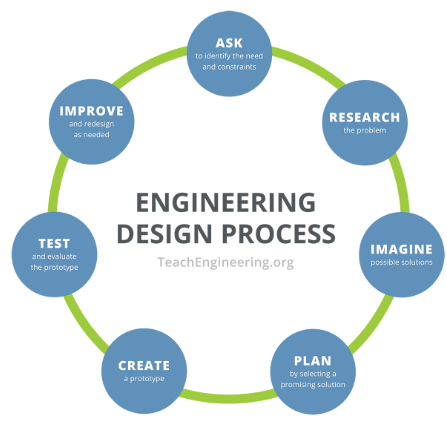

# Tecnologia: indicazioni nazionali {#indicazioni-nazionali}

Estratto da "Indicazioni Nazionali (2012)"

*Lo studio e l’esercizio della tecnologia favoriscono e stimolano la generale attitudine umana a porre e a **trattare problemi**, facendo dialogare e collaborare abilità di tipo cognitivo, operativo, metodologico e sociale. [...]*

*È specifico compito della tecnologia quello di promuovere forme di pensiero che preparino e sostengano **interventi trasformativi** dell’ambiente attraverso un uso consapevole delle risorse nel rispetto di vincoli di vario genere.*

**Il laboratorio**, inteso soprattutto come modalità per accostarsi in modo attivo e operativo a situazioni o fenomeni oggetto di studio, rappresenta il riferimento costante per la didattica della tecnologia; esso combina la progettazione e la realizzazione di semplici prodotti originali con la modifica migliorativa, nel senso dell’efficacia o dell’efficienza, di quelli già esistenti.

*Quando possibile, gli alunni potranno essere introdotti ad alcuni **linguaggi di programmazione** particolarmente semplici e versatili che si prestano a sviluppare il gusto per l’ideazione e la realizzazione di progetti.*

Scarica i documenti ministeriali:

- <a href="indicazioni-nazionali-2012-tecnologia.pdf" target="_blank">Indicazioni nazionali (estratto Tecnologia)</a>
- <a href="indicazioni-nazionali-nuovi-scenari.pdf" target="_blank">Indicazioni nazionali (aggiornamento)</a>

## Obiettivi di apprendimento (Learning objectives) {#learning-obj}

- Conoscenze sulla capacità di condurre di alcuni materiali *(Effettuare prove ed esperienze sulle proprietà dei materiali più comuni)*
- Costruzione di un manufatto un controller fisico alternativo a tastiera e mouse *(Impiegare alcune regole del disegno tecnico per rappresentare semplici oggetti - Riconoscere i difetti di un oggetto e immaginarne possibili miglioramenti - Pianificare la fabbricazione di un semplice oggetto elencando gli strumenti e i materiali necessari - Realizzare un oggetto in cartoncino descrivendo e documentando la sequenza delle operazioni.)*
- Semplice programmazione a blocchi *(con Scratch 3.0)* per programmi personalizzati

# Lavorare in gruppo per progettare e realizzare {#lavorare-gruppo}

Estratto dal sito [Teach Engineering](https://www.teachengineering.org/populartopics/designprocess#edpAsk).

Guarda anche le attività che propone per le [STEM del primo ciclo K-12](https://www.teachengineering.org/curriculum/browse?EngineeringCategory=Full%20design).

### ASK - Interrogati {#Ask}

I **progettisti si pongono domande** critiche su ciò che vogliono creare, che si tratti di un grattacielo, di un parco divertimenti, di una bicicletta o di uno smartphone.
Queste domande includono:

- Qual è il problema da risolvere?
- Cosa vogliamo progettare?
- Per chi è?
- Cosa vogliamo realizzare?
- Quali sono i requisiti del progetto?
- Quali sono i limiti?
- Qual è il nostro obiettivo?

### RESEARCH - Analizza il problema {#Research}

È fondamentali **parlare con i compagni per aiutarsi** e ricercare quali prodotti o soluzioni esistono già o quali tecnologie potrebbero essere adattabili alle esigenze del caso.

### IMAGINE - Immagina e sviluppa soluzioni possibili {#Imagine}

Lavora con un team per raccogliere idee e sviluppare quante più soluzioni possibili. Questo è il momento di incoraggiare tutte le soluzioni possibili! Costruisci sulle idee degli altri! Rimani concentrato sull'argomento e fai una conversazione alla volta! Ricorda: il buon design è tutto basato sul **lavoro di squadra!**

### PLAN - Scegli una soluzione promettente {#Plan}

Per molti team questo è il passo più difficile! Rivedi le esigenze, i vincoli e la ricerca dei passaggi precedenti, confronta le migliori idee, **scegli una soluzione** e fai un piano per realizzarla.

### CREATE - Crea un prototipo {#Create}

**Costruire un prototipo rende le tue idee reali!** Queste prime versioni della soluzione di progettazione, aiutano il tuo team a verificare se il progetto soddisfa gli obiettivi della sfida originale. Impiega creatività, immaginazione e qualità nel design.

### TEST - Testa e valuta il prototipo {#Test}

Funziona? Risolve la necessità? **Analizza e parla** di cosa funziona, cosa no e cosa potrebbe essere migliorato.

### IMPROVE - Migliora e riprogettare {#Improve}

**Discuti come potresti migliorare** la tua soluzione. Fai revisioni. Realizza nuovi disegni. Migliora il tuo design per rendere il tuo prodotto il migliore possibile. E ora, RICOMINCIA DACCAPO!