# BEEBOT - Unità di Apprendimento

**Ordine di scuola:** scuola primaria

**Classe:** 2^

**Obiettivo:** sviluppo del pensiero computazionale mediante la creazione di una città inventata

**Discipline coinvolte:** Italiano, Tecnologia, Arte e Immagine

**Metodologie didattiche:** Peer-tutoring, Circle Time, Cooperative Learning

## Indicazioni nazionali {#indicazioni-nazionali}

### Italiano

**Traguardi per lo sviluppo delle competenze al termine della scuola primaria**

L’allievo partecipa a scambi comunicativi (conversazione, discussione di classe o di gruppo) con compagni e insegnanti rispettando il turno e formulando messaggi chiari e pertinenti, in un registro il più possibile adeguato alla situazione.

**Obiettivi di apprendimento al termine della classe terza della scuola primaria:**
*Ascolto e parlato*

- Prendere la parola negli scambi comunicativi (dialogo, conversazione, discussione) rispettando i turni di parola. 
- Comprendere l’argomento e le informazioni principali di discorsi affrontati in classe.

### Matematica

**Traguardi per lo sviluppo delle competenze al termine della scuola primaria**

Costruisce ragionamenti formulando ipotesi, sostenendo le proprie idee e confrontandosi con il punto di vista di altri.

**Obiettivi di apprendimento al termine della classe terza della scuola primaria:**
*Spazio e figure*

- Comunicare la posizione di oggetti nello spazio fisico, sia rispetto al soggetto, sia rispetto ad altre persone o oggetti, usando termini adeguati (sopra/sotto, davanti/dietro, destra/sinistra, dentro/fuori). 
- Eseguire un semplice percorso partendo dalla descrizione verbale o dal disegno, descrivere un percorso che si sta facendo e dare le istruzioni a qualcuno perché compia un percorso desiderato. 

### Arte e immagine

**Traguardi per lo sviluppo delle competenze al termine della scuola primaria**

L’alunno utilizza le conoscenze e le abilità relative al linguaggio visivo per rielaborare in modo creativo le immagini con molteplici tecniche, materiali e strumenti (grafico-espressivi, pittorici e plastici).

**Obiettivi di apprendimento al termine della classe quinta della scuola primaria:**
*Esprimersi e comunicare*

- Elaborare creativamente produzioni personali e autentiche per esprimere sensazioni ed emozioni; rappresentare e comunicare la realtà percepita; 
- Trasformare immagini e materiali ricercando soluzioni figurative originali.
- Sperimentare strumenti e tecniche diverse per realizzare prodotti grafici, plastici, pittorici e multimediali.

### Tecnologia

**Traguardi per lo sviluppo delle competenze al termine della scuola primaria**

Inizia a riconoscere in modo critico le caratteristiche, le funzioni della tecnologia attuale.

**Obiettivi di apprendimento al termine della classe quinta della scuola primaria:**
*Intervenire e trasformare*

- Realizzare un oggetto in cartoncino descrivendo e documentando la sequenza delle operazioni.

## Fasi e attività {#fasi-attivita}

### Lezioni in sintesi

**Lezione 1**

Nella prima lezione la docente fornisce ad ogni studente un foglio di carta sul quale **annotare le proprie idee in merito agli edifici e alle strutture** che vorrebbe nella città, per sé e per i propri compagni.
Successivamente ciascun bambino legge al gruppo classe le proprie idee e di queste si selezionano le più significative. 

**Lezione 2**

Nella seconda lezione i fanciulli si dedicano alla **costruzione degli edifici**.

**Lezione 3**

Realizzata la città, gli studenti si occupano della creazione del proprio personaggio mediante la **tecnica del Papercraft**.

**Lezione 4**

Gli alunni svolgono **un’attività di coding unplugged**: un fanciullo per volta fornisce i comandi alla Bee-Bot per raggiungere il suo personaggio posizionato nella città. Gli studenti, poi, propongono delle idee per **realizzare una storia su Caramellandia** Bee-Bot. 

**Lezione 5**

I bambini trovano delle soluzioni alla presenza di nuovi personaggi e oggetti all’interno della città. Infine, mettono in atto le **varie sfide della storia con la Bee-Bot**.

### Descrizione delle fasi

#### **Lezione 1**

La fase attiva è iniziata con l’illustrazione generica al gruppo di classe dell’UdA. La proposta di realizzare una loro città inventata ha suscitato immediatamente risposte molto positive tra gli alunni, i quali hanno voluto subito mettersi all’opera.

Per prima cosa abbiamo **Consegnato a ciascun allievo un foglio di carta su cui annotare le proprie idee sul tipo di città** che avrebbero voluto creare per la propria classe. Gli studenti, con grande entusiasmo e concentrazione, hanno iniziato ad elencare edifici, strutture e tutto ciò che desideravano nella loro città ideale. 

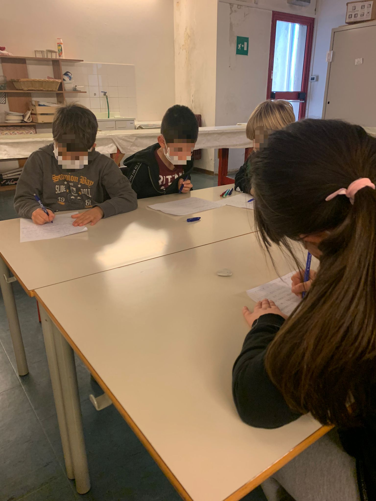

Successivamente, attraverso la **metodologia didattica del Circle Time**, ogni bambino ha letto le sue proposte, e con alzata di mano, ogni fanciullo ha scelto una/due proposte per bambino, in modo tale da considerare le idee di tutti e allo stesso tempo determinare le più significative.

Per quanto riguarda **il nome della città,** la proposta che ha maggiormente soddisfatto l’intero gruppo classe è stata quella di uno studente, «Caramellandia Bee-Bot», il quale si è ispirato ad una storia letta in classe da parte della docente. Riguardo agli edifici, invece, i più votati sono stati: **il parco giochi, l’hotel, la stazione e delle case**. 

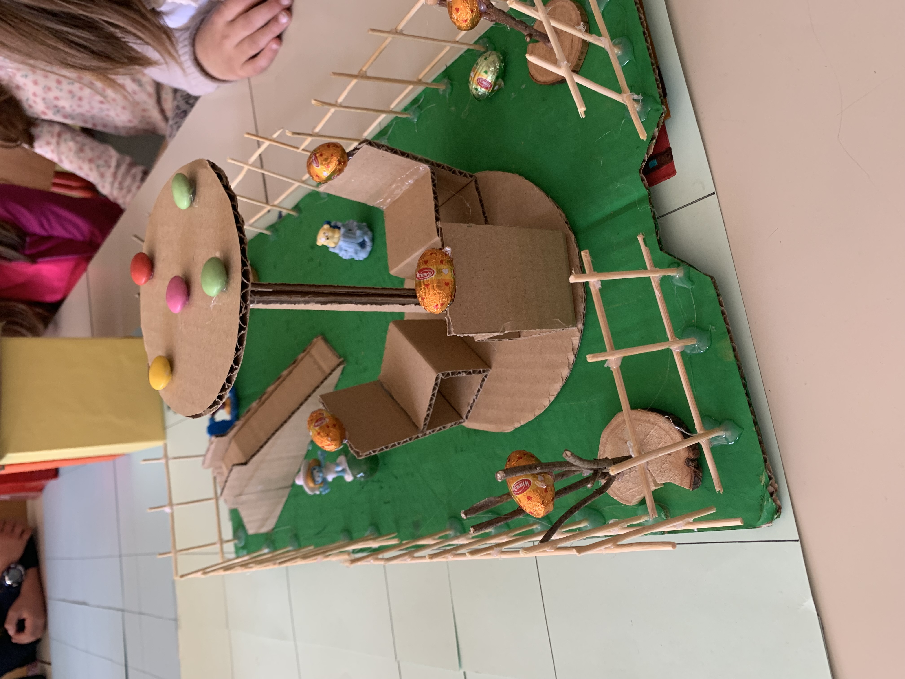

Dopo aver individuato tali costruzioni, io e la collega ci siamo concentrate su come realizzarli, optando soprattutto per l’utilizzo di scatole vuote. 

---

#### **Lezione 2**

Nella seconda lezione gli allievi, aiutanti dall’insegnante di sostegno e dall’insegnante di classe, hanno realizzato gli edifici, dando sfogo alla propria creatività e fantasia. 

**Per la costruzione delle case e dei palazzi gli studenti hanno usato delle scatole di cereali o della pasta**; per la creazione del parco e dei giochi al suo interno, invece, hanno usato un pezzo di cartone e con degli stuzzicadenti hanno realizzato la staccionata. Sono stati, inoltre, attaccati cioccolatini e caramelle agli edifici, per ricollegarsi al tema generale della città. 

La base su cui posizionare tutte queste strutture è stata realizzata da me attraverso un cartellone diviso in venticinque quadrati con i lati lunghi cinque centimetri l’uno, corrispondenti ad un passo della Bee-Bot, proprio poiché tale cartellone costituisce la griglia su cui far muovere il robot.  

---

#### **Lezione 3**

Nella terza lezione, io e la docente abbiamo ripetuto ai bambini chi sarebbero stati gli abitanti della città: loro stessi e **Bee-Bot, il robot educativo che li avrebbe accompagnati in questa avventura**.

L’idea che è venuta a me e all’insegnante è stata quella di realizzare dei robot che rappresentassero tutti i bambini della classe, attraverso la **tecnica del Papercraft**: abbiamo consegnato agli allievi un modellino bianco, sul quale loro dovevano, individualmente, disegnare come si immaginavano da robot. I fanciulli hanno dato libero sfogo alla loro fantasia e sono emersi dei personaggi completamente diversi gli uni dagli altri, rappresentativi anche della personalità di ciascuno di loro.

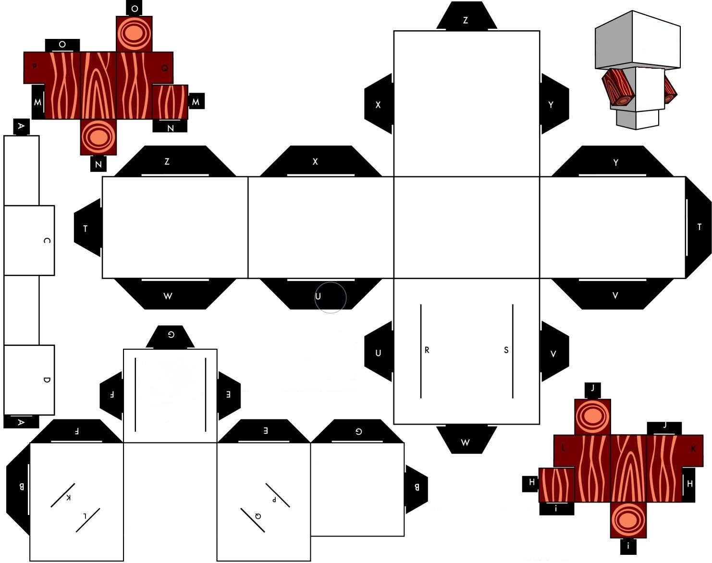

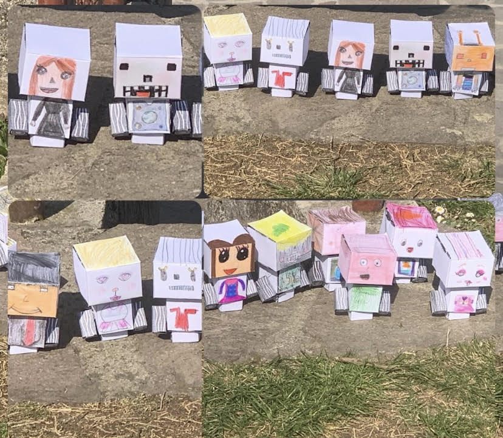

---

#### **Lezione 4**

Nel corso della quarta lezione, gli studenti, innanzitutto, hanno **posizionato gli edifici e i loro personaggi sul cartellone** della città, scegliendo liberamente dove collocarli. 

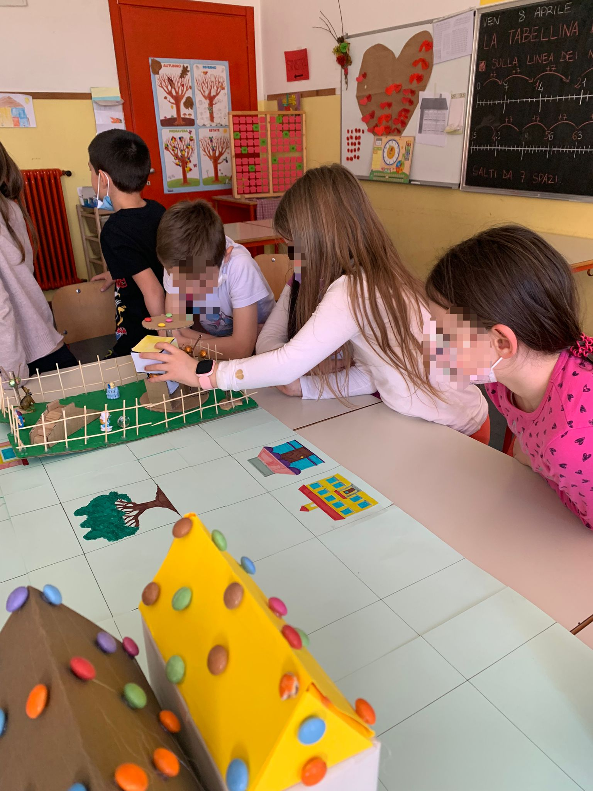

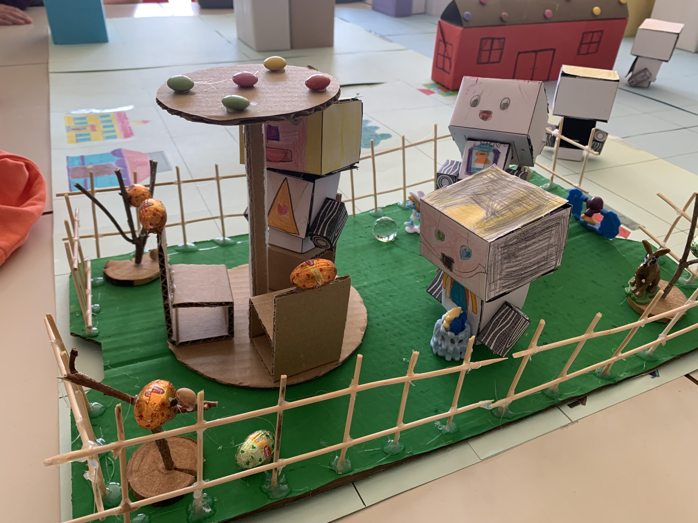

Successivamente, dopo aver completato la città, ogni allievo ha avuto **il compito di far arrivare la Bee-Bot al suo personaggio**. Gli studenti hanno svolto l’attività mettendo in atto le loro capacità, e hanno dimostrato grande apprezzamento per l’esercizio, chiedendoci di poterlo rifare più di una volta.

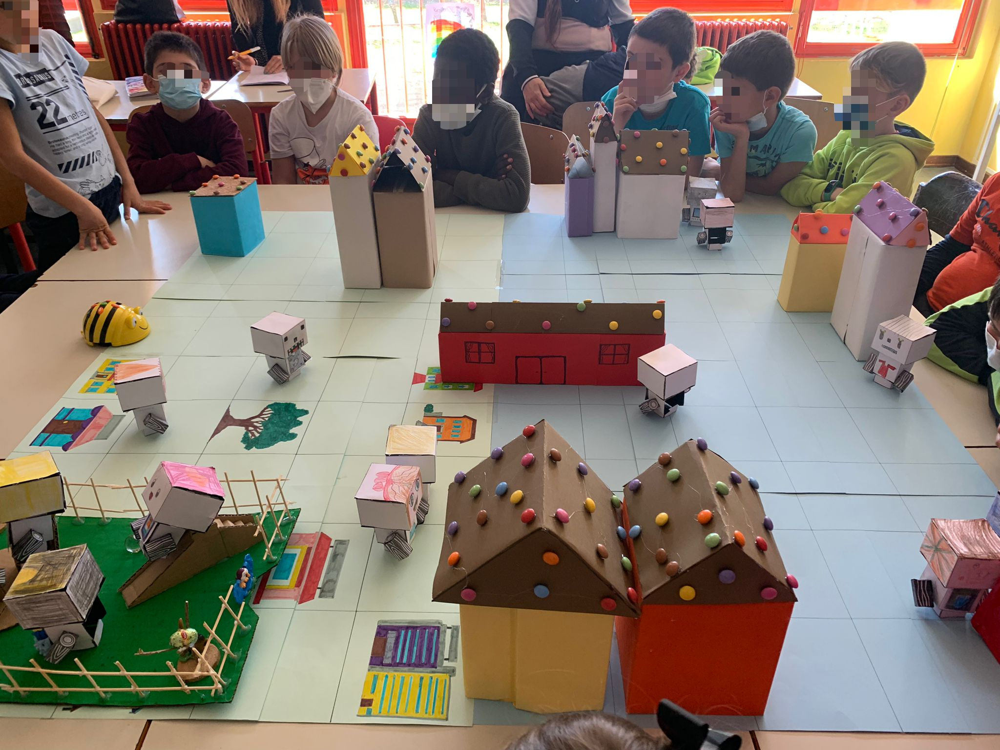

Interessante è stato, soprattutto, osservare come di fronte alle difficoltà mostrate da alcuni allievi, i compagni siano sempre intervenuti per cercare di aiutarli, facendo capire loro l’errore che stavano compiendo e illustrando le soluzioni per evitarlo.

Al termine di questa attività, io e la docente ci siamo concentrate sulla **[creazione di una storia su Caramellandia Bee Bot](#caramellandia-racconto)**. Abbiamo deciso di ascoltare le proposte degli studenti, mediante la metodologia didattica del **Circle Time**, per poi metterle insieme e scrivere una storia.

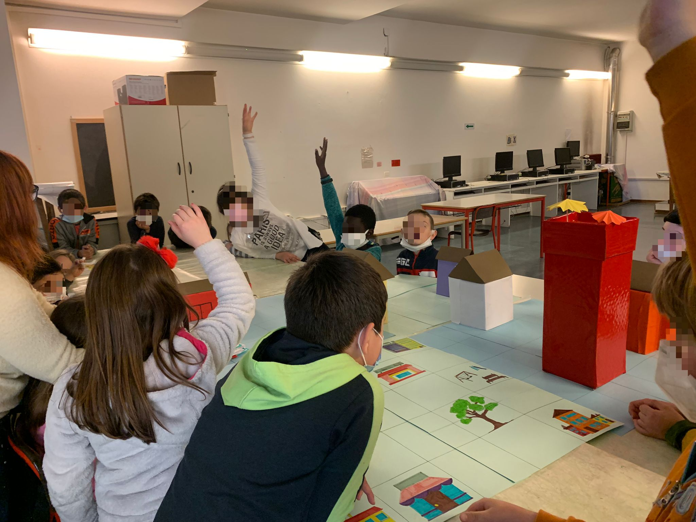

È emerso subito, dalle idee dei bambini, che i protagonisti dovevano essere i loro robot e anche Bee-Bot. Io e la docente abbiamo suggerito di creare una storia con delle sfide, in modo tale da poterle poi affrontare anche concretamente sulla griglia.

 Le proposte degli alunni sono state numerose e creative, e sulla base di queste ho realizzato una storia di fantasia, intitolata **[«Caramellandia Bee-bot»](#caramellandia-racconto)**: i protagonisti sono proprio gli studenti, che vengono trasformati, con una pozione magica, in dei robot e teletrasportati in una città chiamata «Caramellandia Bee-Bot», abitata soltanto da robot, tra cui Bee-bot. In questa città i fanciulli devono affrontare quattro sfide per poter recuperare «La Pietra dell’umanità», che gli permetterà di ritornare nella scuola primaria di Bondo Petello. La loro aiutante è proprio Bee-bot, che compirà le sfide al loro posto.

---

#### **Lezione 5**

Completata la storia, durante la quinta lezione, io e l’insegnante di classe abbiamo deciso di farci **aiutare dagli studenti nella risoluzione di un problema** emerso con la scrittura della storia: ovvero la presenza di nuovi personaggi e oggetti (come gli animali pericolosi e il «Caramello volante» presenti rispettivamente nella prima e nella seconda sfida), che devono essere rappresentati e inseriti nella città.

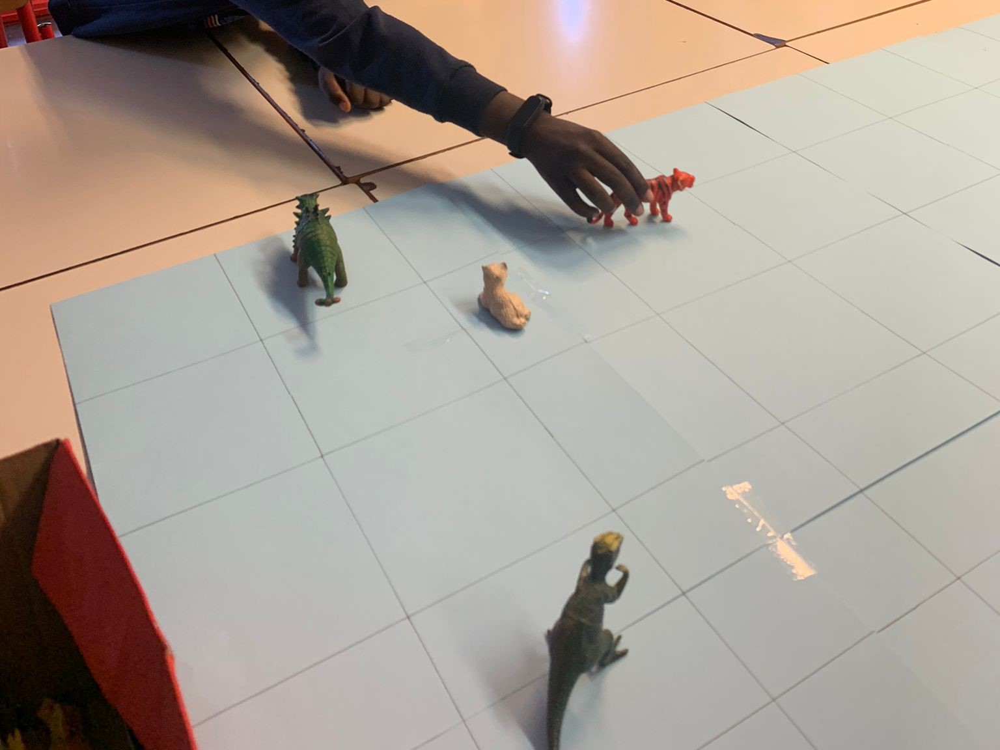

Le soluzioni individuate sono state le seguenti: dei giocattoli a forma di animali per rappresentare appunto gli animali pericolosi; degli studenti hanno realizzato il **«Caramello volante»** con il solo utilizzo di carta, forbice e colla; la chiave di una porta a rappresentazione della chiave da nascondere nel parco per aprire lo scrigno; ed infine, come «Pietra dell’umanità», il ciondolo di una collana.

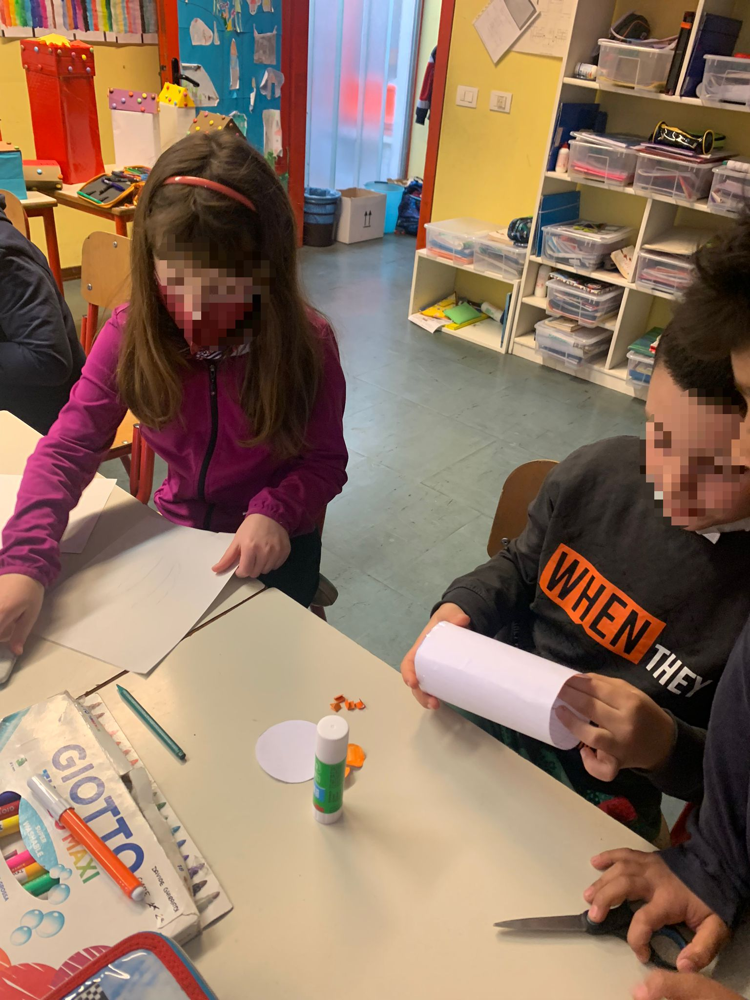

Tutti insieme, invece, gli studenti hanno deciso la “frase magica” da inserire nella storia. Alcuni di loro hanno fatto delle proposte, che sono state segnate sulla lavagna, e dopo di che si è passati alle votazioni. La frase che ha ottenuto il maggior numero di voti è stata: **«O mio potente scrigno, apriti per favore!»**.

<a href="./beebot_parola_magica.webm" target="_blank">Guarda il video</a>
[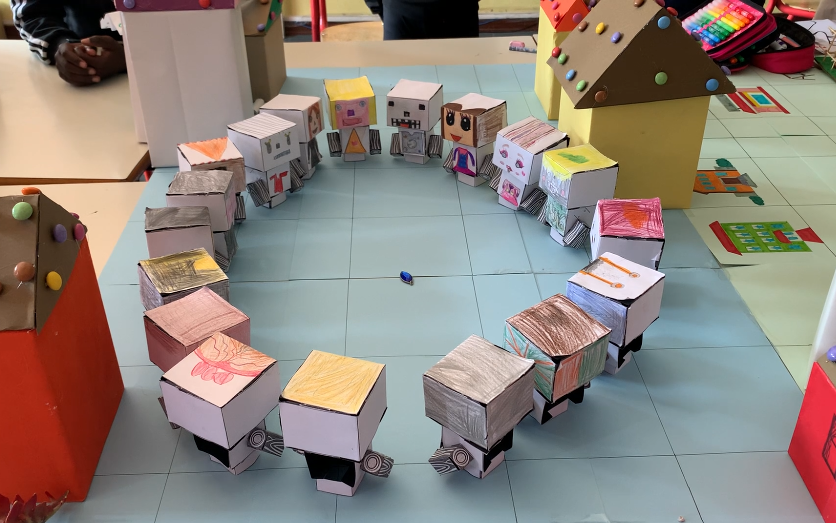]()

Per concludere alcuni allievi hanno messo in atto le sfide presentate nella storia, tramite un’attività di coding unplugged utilizzando la Bee-Bot. 

### Caramellandia BEE-BOT: il racconto {#caramellandia-racconto}

C’era una volta un gruppo di amici, erano 18 in totale, avevano tra i 7 e gli 8 anni e vivevano tutti ad Albino. Durante il laboratorio di scienze, i bambini si divertivano sempre a creare delle pozioni fantasiose, mescolando vari elementi come acqua, terra, zucchero, sale, perfino tempere e brillantini.

Un giorno decisero di provare ad unire in una grossa provetta tutti gli elementi che avevano in classe... ma qualcosa andò storto! Una forte luce uscì dal contenitore, susseguita da una nube che avvolse i fanciulli, facendoli cadere in un lungo sonno.

Si risvegliarono in una nuova città, dove tutto sembrava fatto di dolci: c’erano case con gli Smarties, fontane di cioccolato... gli amici erano senza parole! Inoltre, si accorsero, guardandosi gli uni e gli altri, che si erano trasformati tutti in dei robot!

Poco dopo, videro passare per la strada un abitante... era Bee-Bot! Non ci potevano credere che il robottino che usavano in classe ora si trovasse nella loro stessa città, così subito gli chiesero:
*«Bee-Bot ma non dovresti essere a scuola, chiuso in una scatola dentro l’armadio? Cosa ci fai qui?».*
Lui subito rispose:
*«Ciao amici! Finalmente posso parlarvi anche io. Questa è la mia città, si chiama “Caramellandia Bee-Bot” e ogni giorno, quando voi ritornate a casa, io esco dalla scatola e raggiungo qui i miei amici e la mia famiglia. Come vedete, qui tutto è fatto di dolci e gli abitanti sono dei robot. Ma voi come fate ad essere qui? Non ditemi che avete mischiato tutti gli ingredienti dentro la provetta?».*
In coro i bambini risposero:
*«SIII!».*
Bee-Bot allora iniziò a raccontare:
*«Ora mi è tutto più chiaro! Ma avete un problema: se volete ritornare sulla terra e riavere delle sembianze umane, allora dovrete recuperare la pietra dell’umanità».*
I fanciulli rimasero sorpresi nell’ascoltare quella strana parola e chiesero all’apetta maggiori dettagli.
*«Si tratta di una pietra verde smeraldo con un potere magico. Si trova custodita in un luogo segreto della città di Caramellandia e per trovarla dovrete superare tre prove».*
I bambini si spaventarono e iniziarono a domandarsi come fare ad affrontare quelle misteriose prove. Bee-Bot li tranquillizzò subito dicendo:
*«Non vi preoccupate, io sarò il vostro aiutante, e poi voi in realtà siete già abituati a queste sfide: come fate in classe, così ora dovrete darmi le indicazioni per muovermi e io vi guiderò alla scoperta della pietra dell’umanità».*
*«La prima sfida consiste nel superamento di pericolosi ostacoli: nella città c’è infatti una zona spaventosa, dove animali terrificanti si aggirano. Dovete aiutarmi a schivarli, senza farmi prendere da loro».*
*«Nella seconda sfida, invece, mi dovete far passare per la città senza farmi colpire dal caramello volante. Se mi colpirà le mie ruote diventeranno tutte appiccicose e io non riuscirò più a muovermi!».*
*«La terza sfida è una caccia al tesoro: dentro al parco è nascosta la chiave per aprire lo scrigno. Portatemi lì e io ve la troverò!».*
*«Eccoci arrivati all’ultima prova bambini, ben fatto! Adesso dobbiamo andare nel luogo più importante della città perché è lì che si trova lo scrigno contenente la pietra dell’umanità. Andiamo!».*

Dopo aver superato queste difficili sfide, Bee-Bot recuperò la pietra dell’umanità e la consegnò ai bambini. Loro rimasero meravigliati dalla bellezza di quella pietra verde smeraldo: luccicava ed emanava una luce fortissima.
Gli amici, insieme, si misero in cerchio tenendosi per mano, e al centro posero la pietra dell’umanità.
In coro gridarono la parola magica per aprirlo **«O mio potente scrigno, apriti per favore!»**, ed ecco che un portale dietro di loro si aprì. Prima di andarsene salutarono Bee-Bot, ringraziandolo per l’aiuto datogli.
Varcato il vortice si ritrovarono ben presto nuovamente nella loro classe: erano di nuovo degli esseri umani!

Felici di aver risolto quelle sfide insieme, i bambini non dimenticarono mai dell’avventura vissuta.
