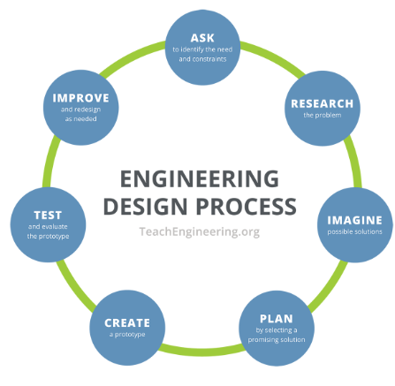
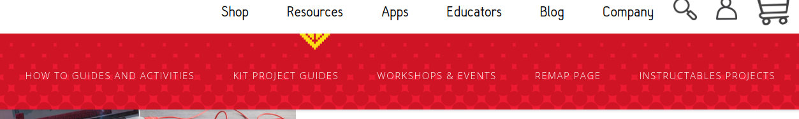
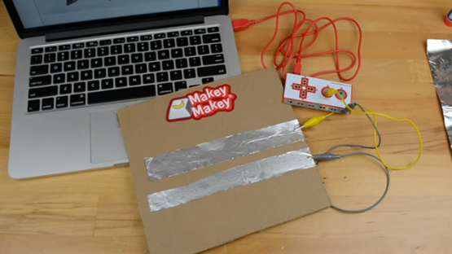

# Tecnologia

Estratto da "Indicazioni Nazionali (2012)"

*Lo studio e l’esercizio della tecnologia favoriscono e stimolano la generale attitudine umana a porre e a **trattare problemi**, facendo dialogare e collaborare abilità di tipo cognitivo, operativo, metodologico e sociale. [...]*

*È specifico compito della tecnologia quello di promuovere forme di pensiero che preparino e sostengano **interventi trasformativi** dell’ambiente attraverso un uso consapevole delle risorse nel rispetto di vincoli di vario genere.*

***Il laboratorio**, inteso soprattutto come modalità per accostarsi in modo attivo e operativo a situazioni o fenomeni oggetto di studio, rappresenta il riferimento costante per la didattica della tecnologia; esso combina la progettazione e la realizzazione di semplici prodotti originali con la modifica migliorativa, nel senso dell’efficacia o dell’efficienza, di quelli già esistenti.*

*Quando possibile, gli alunni potranno essere introdotti ad alcuni **linguaggi di programmazione** particolarmente semplici e versatili che si prestano a sviluppare il gusto per l’ideazione e la realizzazione di progetti.*

---

# Makey Makey - Invention kit - Tinkering

Intervento di [Jay Silver a TED](https://www.ted.com/talks/jay_silver_hack_a_banana_make_a_keyboard?language=it&subtitle=it).

##### Learning objectives (obiettivi di apprendimento)

- Conoscenze sulla capacità di condurre di alcuni materiali *(Effettuare prove ed esperienze sulle proprietà dei materiali più comuni)*
- Costruzione di un manufatto un controller fisico alternativo a tastiera e mouse *(Impiegare alcune regole del disegno tecnico per rappresentare semplici oggetti - Riconoscere i difetti di un oggetto e immaginarne possibili miglioramenti - Pianificare la fabbricazione di un semplice oggetto elencando gli strumenti e i materiali necessari - Realizzare un oggetto in cartoncino descrivendo e documentando la sequenza delle operazioni.)*
- Semplice programmazione a blocchi *(con Scratch 3.0)* per programmi personalizzati

##### Lavorare in gruppo per progettare e realizzare

##### MAKEY-MAKEY

###### Contenuto del kit

###### Homepage

###### How-to e kit project

###### Testare proprietà elettriche di alcuni materiali.

###### Costruire: drum machine, pianola/synth, controller.

[Disegna uno strumento](https://makeymakey.com/blogs/how-to-instructions/lesson-four-draw-a-playable-instrument)

[Chitarra](https://makeymakey.com/blogs/how-to-instructions/creating-a-guitar-in-scratch-or-soundplant)

[Game controller](https://makeymakey.com/blogs/how-to-instructions/create-a-controller-to-plug-and-play-1)

Per testarli utilizza le [APP](https://makeymakey.com/pages/plug-and-play-makey-makey-apps) che trovi nel sito.

###### Realizzare giochi interattivi (pannelli, quiz, time reaction).

[Poster interattivo](https://makeymakey.com/blogs/how-to-instructions/makey-makey-interactive-poster) (geografia, matematica, etc...)

[Wire game](https://makeymakey.com/blogs/how-to-instructions/new-project-november-makey-makey-wire-game)

###### Altri progetti su [Instructables](https://www.instructables.com/makeymakey/)

##### Utilizzare Scratch

###### Realizzare un pannello su argomenti didattici (geografia, geometria, ...) in stile quiz.

###### In Scratch realizzare un'attività con i gesti caricando l'apposita estensione.

##### Materiali utili durante le attività

- Alluminio tipo domopack
- Colla stick
- Carta
- Cartone
- Fili di rame (materiale elettrico)
- Forbici
- Graffette
- Matite morbide (HB->6B)
- Nastro isolante
- Pasta modellabile
- Puntine

