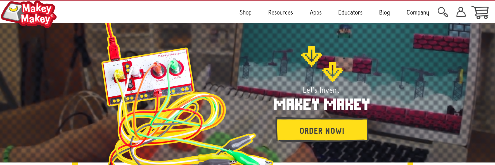
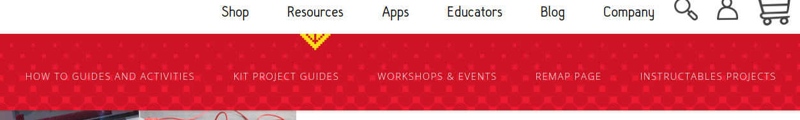
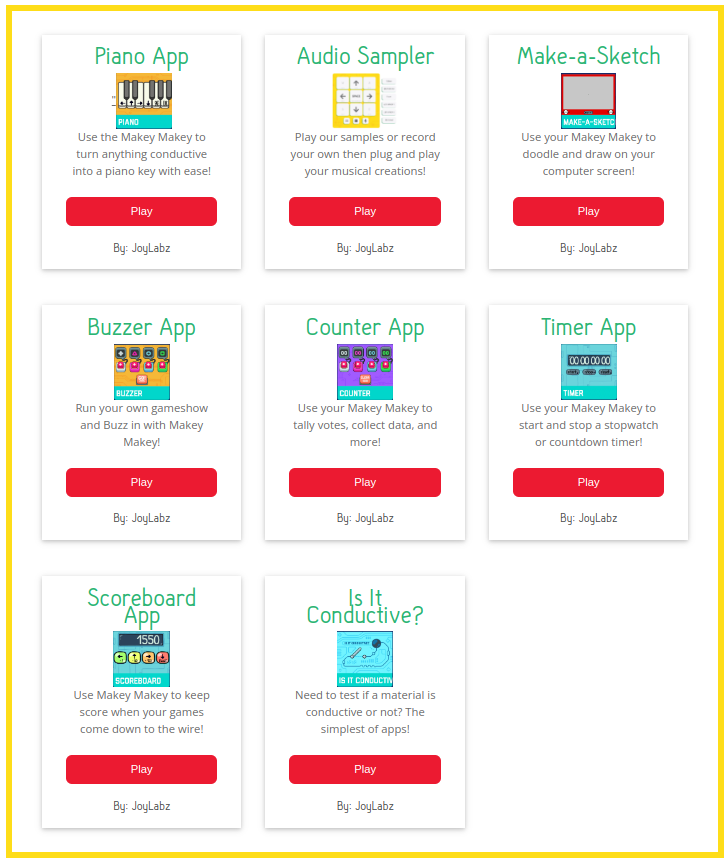
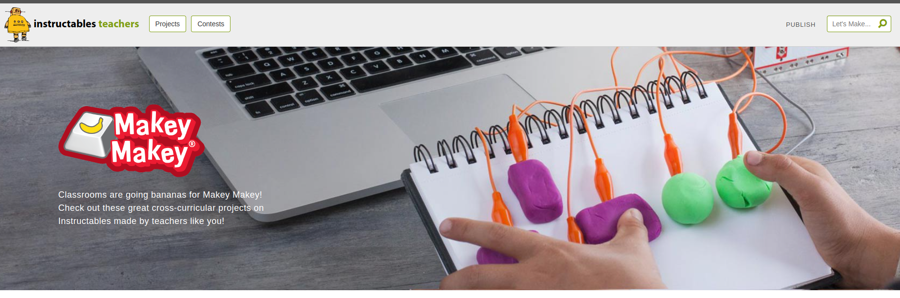
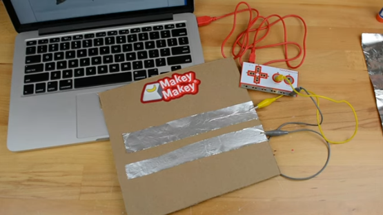
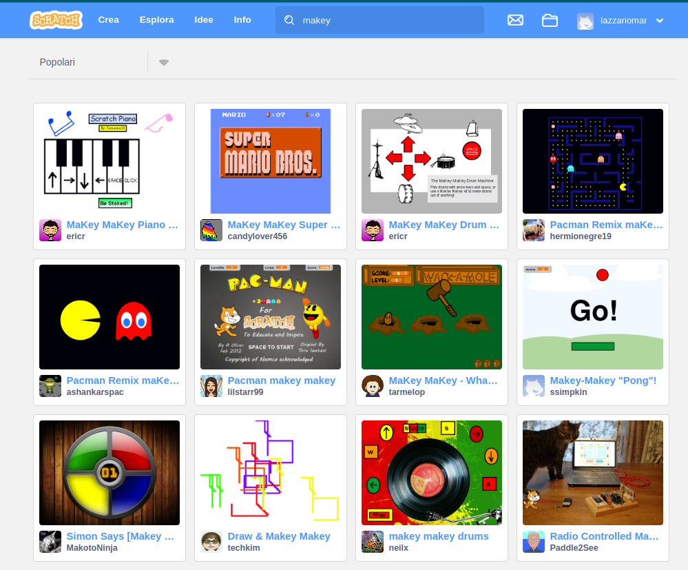
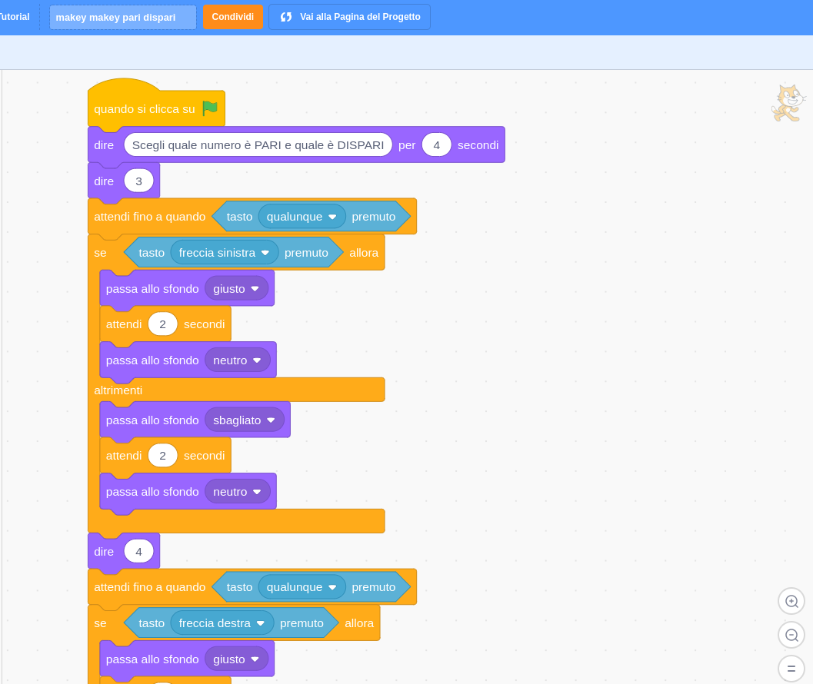
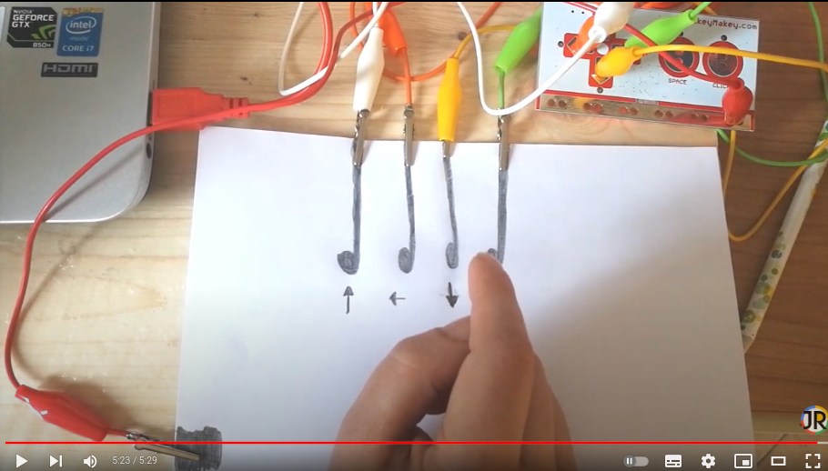
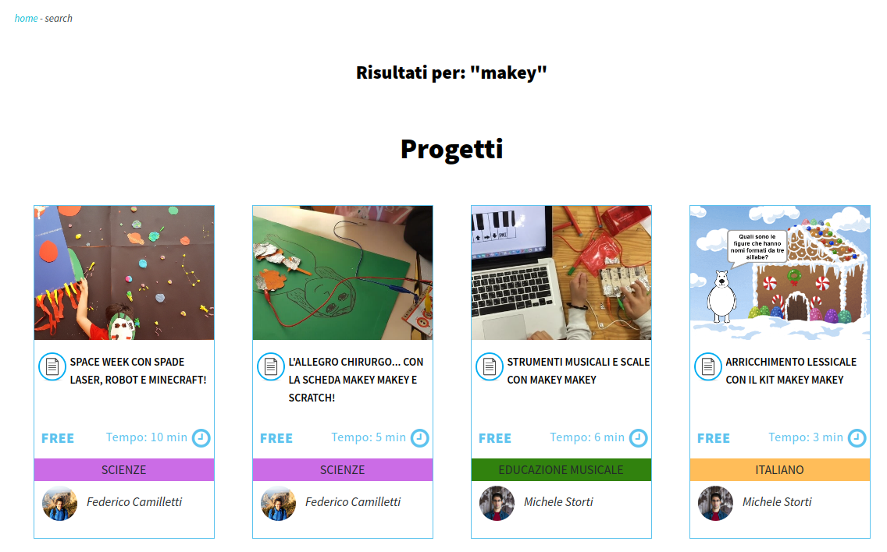

# Makey Makey - Invention kit - Tinkering

Intervento di [Jay Silver a TED](https://www.ted.com/talks/jay_silver_hack_a_banana_make_a_keyboard?language=it&subtitle=it).

## Cosa serve: kit e altro {#makey-kit}

### Makey-makey kit base

### Materiali utili durante le attività

- Alluminio tipo domopack
- Colla stick
- Carta
- Cartone
- Fili di rame (materiale elettrico)
- Fermacampione
- Forbici
- Graffette
- Matite morbide (HB->6B)
- Nastro isolante
- Pasta modellabile
- Puntine

## Home page e risorse on line {#makey-homep}

Visita il [sito web ufficiale](https://makeymakey.com/).

### How-to e APP

Il menù risorse (resources) contiene molte idee per **[realizzare numerosi progetti](https://makeymakey.com/pages/how-to),** divisi per età e tipologia 

e alcune **[applicazioni](https://makeymakey.com/pages/plug-and-play-makey-makey-apps#)** per utilizzare Makey Makey senza bisogno di crearne di propri.

### Altri progetti su [Instructables](https://www.instructables.com/makeymakey/)

[Instructables](https://www.instructables.com) è un sito per la condivisione di progetti creativi di qualunque ambito, offerto dalla software house **Autodesk** (software di disegno per architettura ed ingegneria).

All'interno del sito esiste un'ampia [sezione dedicata](https://www.instructables.com/makeymakey/) a Makey Makey. 

## Progetti da realizzare {#progetti-realizzare}

### Testare proprietà elettriche di alcuni materiali

Conduttivo o isolante? Costruire un tester per verificare le proprietà elettriche degli oggetti.

### Costruire: drum machine, pianola/synth, controller.

[Disegna uno strumento](https://makeymakey.com/blogs/how-to-instructions/lesson-four-draw-a-playable-instrument)

[Chitarra](https://makeymakey.com/blogs/how-to-instructions/creating-a-guitar-in-scratch-or-soundplant)

[Game controller](https://makeymakey.com/blogs/how-to-instructions/create-a-controller-to-plug-and-play-1)

Per testarli utilizza le [applicazioni](https://makeymakey.com/pages/plug-and-play-makey-makey-apps#) che trovi nel sito.

### Realizzare giochi interattivi (pannelli, quiz, time reaction).

[Wire game](https://makeymakey.com/blogs/how-to-instructions/new-project-november-makey-makey-wire-game)

[Poster interattivo](https://makeymakey.com/blogs/how-to-instructions/makey-makey-interactive-poster) (geografia, matematica, etc...)

### Percorso di classe suggerito dal sito

Scarica <a href="MakeyMakey-slides.pdf" target="_blank">queste slide</a>, illustrano un percorso di attività, suggerite dal sito ufficiale, da svolgere con la propria classe.

Queste slide si trovano sul sito di Makey Makey [a questa pagina](https://makeymakey.com/blogs/blog/resources-for-teaching-makey-makey-at-home-hybrid-models-or-remote-learning).

## Utilizzare Scratch {#makey-scratch}

### Utilizzare i progetti di Scratch

Cerca i progetti Makey Makey creati dagli utenti sul [sito di Scratch](https://scratch.mit.edu/search/projects?q=makey).

### Realizzare un pannello per un quiz su argomenti didattici (matematica, geometria, geografia,...).

### Utilizzo dei gesti in Scratch

In Scratch si possono realizzare attività utilizzando i gesti (sequenza di tasti premuti) caricando l'[apposita estensione](https://makeymakey.com/blogs/how-to-instructions/secret-codes-with-scratch-3-makey-makey-extension). Creare una variabile con la sequenza in inglese *(left right up down)* per creare un gesto personalizzato.

Guarda [questo esempio](https://scratch.mit.edu/projects/709994597/) o il [video di Jessica](https://www.youtube.com/watch?v=uxhnhvKtLDA&list=RDCMUCIBqredeupwpMgSaA1uteEw).

## Altri siti {#makey-altrisiti}

Quattro progetti offerti dal sito italiano [WeTurtle](https://www.weturtle.org/index.php). Utilizza la lente d'ingrnadimento in alto a destra per cercarli.

[Maestra Marta](https://www.maestramarta.it/makey-makey-classe-5a/)

[Pinterest](https://www.pinterest.it/blurita1902/makey-makey-project/)
