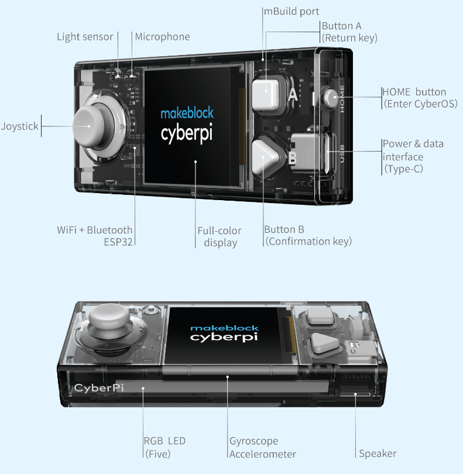

# mBot2 - Physical computing

## Makeblock

mBot è un dei tanti dispositivi elettronici realizzati dalla [Makeblock (visita il sito)](https://www.makeblock.com/) per sviluppare progetti di robotica e making.

La giovanissima società costruisce e vende anche un proprio modello di stampante 3D e una piccola laser-cut.

## mBot2 - specifiche {#mBot2}

mBot2 è il secondo modello del primo robot creato dalla Makeblock. È molto più potente del primo modello, fornito di più sensori on-board e l'unità di calcolo, denominata CyberPi, è estraibile.

A [quest'indirizzo](https://education.makeblock.com/mbot2/) trovi informazioni e risorse specifiche su **mBot2**.

- Bluetooth (solo 4.0 altrimenti serve Dongle-usb)
- Wi-Fi and Wi-Fi LAN
- 5-way joystick
- Button x2
- Reset button
- Light sensor
- Microphone
- Gyroscope-accelerometer
- 1.44″ full color display
- Speaker
- RGB LED x5

## CyberPI

## mBlock {#mBlock}

[mBlock](https://ide.mblock.cc/) è l'IDE (il software per lo sviluppo di applicazioni).

È basato su [Scratch3.0](https://scratch.mit.edu/) con l'aggiunta di estensioni personalizzate per il suo l'utilizzo con i prodotti della Makeblock.

### Installazione in local e versione web

mBlock può essere installato in locale oppure online utilizzando Chrome [scaricandolo da  qui](https://mblock.makeblock.com/en-us/download/).

Se si utilizza la versione web, sarà necessario installare il [software mLink](https://mblock.makeblock.com/en-us/download/mlink/). Quest'ultimo permetterà di utilizzare mBlock anche con ArduinoUNO.

## Risorse per l'insegnante

A [quest'indirizzo](https://education.makeblock.com/resources/res-lower-secondary/85070/) è possibile scaricare la guida introduttiva all'uso di mBot2. Il testo contiene 9 lezioni. Puoi scaricarlo <a href="mBot2-started-guide-V1-1.pdf" target="_blank">anche qui</a>.

| Lezione                  | Descrizione                                                  |
| :----------------------- | ------------------------------------------------------------ |
| 1. Let’s move            | Gli studenti scoprono il software mBot2 e mBlock e imparano a guidare il robot con precisione. Questa conoscenza sarà utilizzata nella maggior parte delle lezioni successive. Gli studenti progetteranno anche un semplice labirinto e programmeranno l'mBot2 per navigare (manualmente) attraverso di esso. |
| 2. Sensing = data        | Gli studenti lavoreranno con i diversi sensori integrati nell'mBot2; impareranno come usarli con i blocchi di codice corrispondenti e come visualizzare i dati dai sensori sul display a colori integrato. |
| 3. Listen to mBot2       | Gli studenti impareranno come controllare l'altoparlante e il microfono con i blocchi di codice in mBlock 5. Creeranno anche un programma in cui mBot2 riproduce un suono registrato se soddisfa una determinata condizione durante la guida. |
| 4. Seeing with sound     | Gli studenti impareranno cos'è l'ultrasuono, come viene utilizzato in un sensore e creeranno anche un programma per fare in modo che mBot2 guidi in un ciclo girando dopo aver rilevato gli ostacoli sulla strada. |
| 5. Sightseeing           | Gli studenti impareranno come funziona un sensore di colore, come vengono utilizzati nella vita reale e programmeranno l'mBot2 in modo che diventi un autobus turistico che visita diversi punti di riferimento in una città. Questa conoscenza sarà applicata anche nelle lezioni 7 e 8. |
| 6. Careful drive         | Gli studenti impareranno come utilizzare l'accelerometro giroscopico dell'mBot2 e i suoi blocchi di codice e programmeranno l'mBot2 per regolare il suo comportamento di guida se rileva inclinazioni sulla strada. |
| 7. A network game        | Gli studenti impareranno ad avere più mBot2 che comunicano tra loro in modalità wireless senza la necessità di un punto di accesso WIFI. Programmeranno un semplice gioco in cui più mBot2 cercano un colore e il primo che lo trova vince. Questa conoscenza sarà utilizzata anche nella lezione 8. |
| 8. mBot2 at your service | Imparando a configurare una connessione WIFI con mBot2, gli studenti impareranno anche a utilizzare il riconoscimento vocale integrato e applicheranno queste conoscenze in un'attività in cui mBot2 diventa un robot cameriere che parla con i suoi clienti. |
| 9. mBot2 in the wild     | In questa lezione speciale, gli studenti impareranno alcuni principi dell'Intelligenza Artificiale utilizzando l'estensione Teachable Machine in mBlock5. Applicheranno le loro conoscenze per ricreare un ecosistema naturale in cui mBot2 si comporta come un animale. |

A [quest'indirizzo](https://education.makeblock.com/resource/) si trovano tutte le risorse di tutti i prodotti Makeblock.